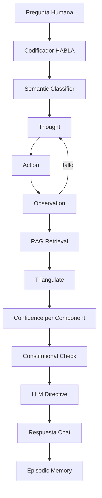

# HABLA: Lenguaje Procedimental Agéntico con Motor de Razonamiento Metacognitivo
# HABLA: An Agentic Procedural Language with a Metacognitive Reasoning Engine

## Resumen
HABLA es un lenguaje procedimental para agentes que integra ReAct, RAG, uso de herramientas, metacognición, triangulación de evidencia, confianza por componente, verificación constitucional y memoria episódica. Su objetivo es reducir alucinaciones y controlar la respuesta de LLMs mediante un runtime externo que decide cuándo buscar, calcular, inferir, bloquear o responder.

## Abstract
HABLA is an agentic procedural language integrating ReAct, RAG, tool use, metacognition, evidence triangulation, per-component confidence, constitutional checks, and episodic memory. It aims to reduce hallucinations by controlling LLM answers through an external runtime that decides when to retrieve, calculate, infer, block, or answer.

## Evolución

### V1
Motor de reglas con estado, bloqueos y validaciones.

### V2
Agente ReAct con Thought, Action, Observation y fallback.

### V3
Metacognición, triangulación y confianza por componente.

### V4
Clasificador semántico y memoria episódica.

## Diagrama general

## Conexión con LLMs
El LLM no responde libremente. Recibe una directiva generada por HABLA con evidencia, confianza, reglas y límites.

## Conclusión
HABLA convierte un LLM en un componente dentro de un sistema de razonamiento controlado, no en el controlador principal.
